# Buenos Aires Data Driven

[](https://github.com/meryboth/buenos-aires-data/actions/workflows/ci.yml)
[](LICENSE)
[](CONTRIBUTING.md)
[](https://data.buenosaires.gob.ar)

**La Ciudad de Buenos Aires en 3D, leída con datos abiertos.** Los 1,4 millones de volúmenes edificados de la ciudad,
con su altura real, cruzados con el Código Urbanístico y otras fuentes de [BA Data](https://data.buenosaires.gob.ar)
para responder preguntas urbanas concretas: ¿cuánto se puede construir todavía?, ¿cómo crece la ciudad en altura?

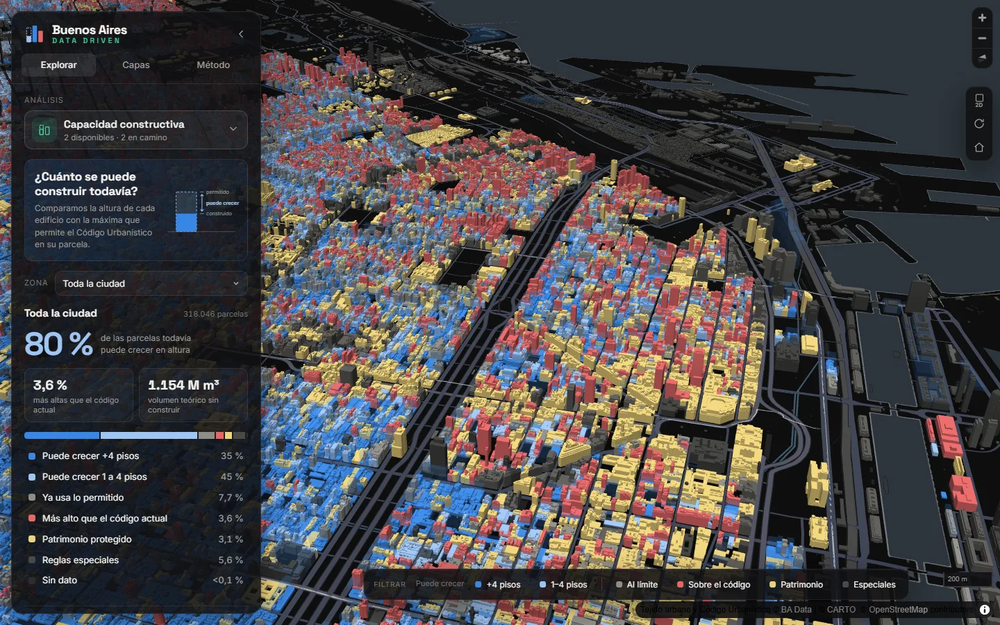

<p align="center">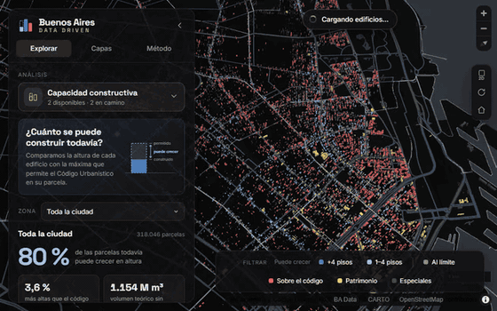</p>

> **Proyecto open source que busca colaboradores.** Si te interesa la ciudad desde el urbanismo, los datos, el diseño o
> el desarrollo, hay lugar para vos: mirá [Colaborá](#colaborá).

---

## Contenido

- [Qué es](#qué-es)
- [Colaborá](#colaborá)
- [Recorrido por la app](#recorrido-por-la-app)
- [Análisis](#análisis)
  - [Capacidad constructiva](#capacidad-constructiva)
  - [Altura de la ciudad](#altura-de-la-ciudad)
  - [Próximos análisis](#próximos-análisis)
- [Cómo funciona](#cómo-funciona)
- [Puesta en marcha](#puesta-en-marcha)
- [Scripts](#scripts)
- [Pipeline de datos](#pipeline-de-datos)
- [Rendimiento](#rendimiento)
- [Pruebas y benchmark](#pruebas-y-benchmark)
- [Estructura del código](#estructura-del-código)
- [Cómo agregar un análisis](#cómo-agregar-un-análisis)
- [Limitaciones conocidas](#limitaciones-conocidas)
- [Hoja de ruta](#hoja-de-ruta)
- [Fuentes, licencias y créditos](#fuentes-licencias-y-créditos)

---

## Qué es

Un visor 3D navegable en el navegador que une **urbanismo, GIS y 3D web**. No es sólo un mapa con edificios: cada vista
es un **análisis** que responde una pregunta sobre la ciudad, con su metodología explícita, estadísticas por barrio y
ficha de cada parcela.

- **1.386.616** volúmenes edificados (Tejido urbano, fotogrametría).
- **318.046** parcelas cruzadas con la normativa vigente del **Código Urbanístico** (diciembre de 2024).
- **48** barrios con estadísticas y rankings.
- Funciona en escritorio y celular, sin claves de API ni servicios pagos.

## Colaborá

Buenos Aires Data Driven es **software libre** (licencia MIT) y crece con aportes de perfiles distintos:

| Si sabés de… | Podés aportar |
|---|---|
| Urbanismo y planificación | Nuevas preguntas y análisis, revisión de metodologías y de la lectura de la normativa |
| GIS y datos | Datasets nuevos, mejoras en los cruces, validación de resultados, capas hechas en QGIS |
| Desarrollo web / 3D | Análisis, interfaz, rendimiento, accesibilidad, publicación |
| Diseño | Visualización, leyendas, experiencia en celular |
| Comunicación | Documentación, tutoriales, difusión de resultados |

**Por dónde empezar:**

1. Leé la [guía para colaborar](CONTRIBUTING.md) y el [código de conducta](CODE_OF_CONDUCT.md).
2. Buscá issues con las etiquetas [`good first issue`](https://github.com/meryboth/buenos-aires-data/labels/good%20first%20issue)
   o [`help wanted`](https://github.com/meryboth/buenos-aires-data/labels/help%20wanted).
3. ¿Tenés una idea? Abrí una [propuesta de análisis](https://github.com/meryboth/buenos-aires-data/issues/new?template=propuesta-de-analisis.yml):
   no hace falta programar para proponer una pregunta sobre la ciudad.

**Se busca ayuda especialmente en:** los análisis *Sol y sombra* y *Densidad y transporte*, la publicación de la app
(tiles en PMTiles y hosting estático), la vista a escala barrio y la validación de resultados en territorio.

## Recorrido por la app

### Selector de análisis

Cada caso de uso se elige desde el panel. Los análisis marcados como *Próximamente* ya están previstos en el registro.

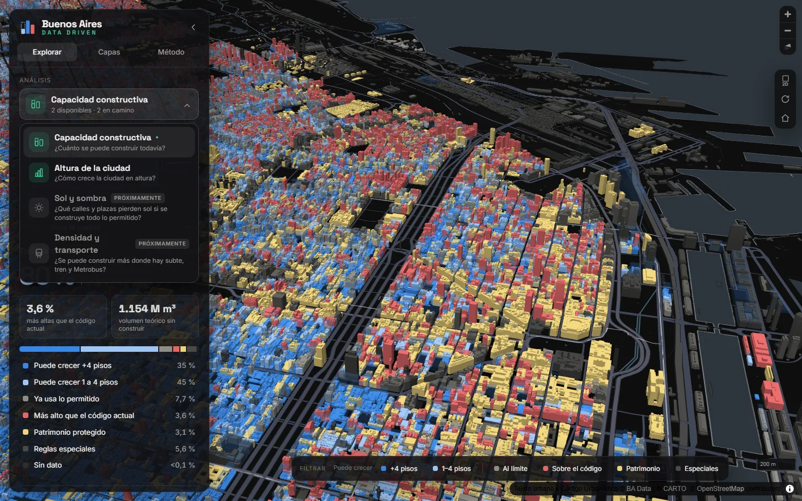

### Ficha de parcela

Al hacer clic en un edificio se abre su ficha: categoría, altura construida frente a la permitida (con un indicador
visual) y datos normativos. Los volúmenes translúcidos muestran **lo que falta construir** hasta el límite del código.

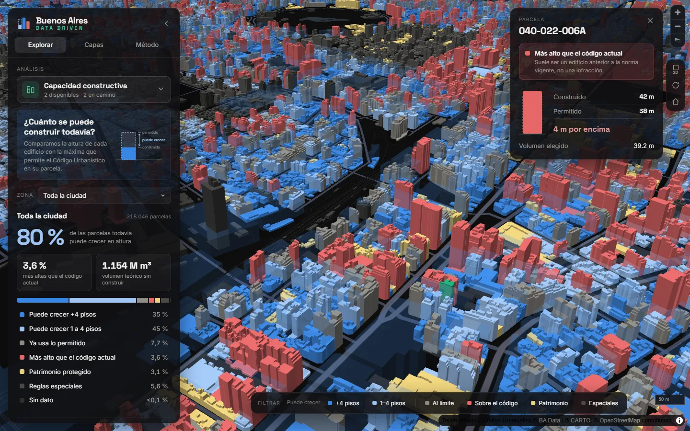

### Leyenda que filtra

La leyenda flotante funciona como filtro: al elegir una categoría, el resto de la ciudad queda en translúcido.

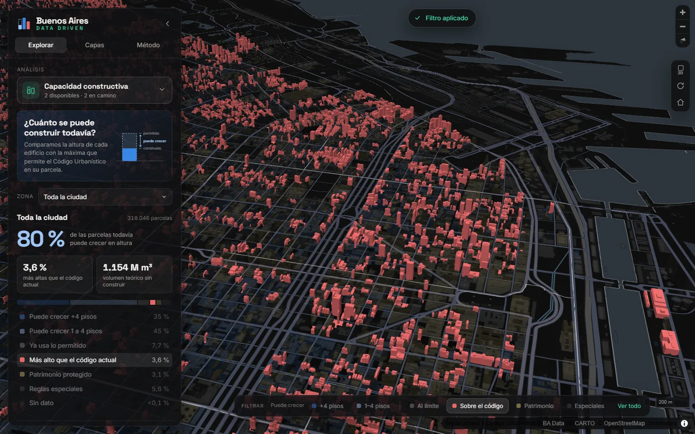

### Zonas

El selector de zona cambia las estadísticas a las de un barrio, centra el mapa y resalta su contorno.

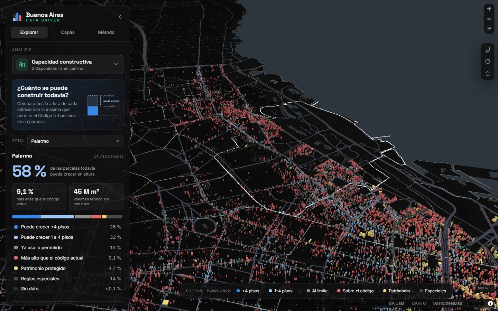

### Capas y metodología

La pestaña **Capas** suma recorridos de colectivos, ciclovías y límites de barrios. La pestaña **Método** explica cómo
se calcula cada análisis y enlaza las fuentes.

| Capas | Método |
|---|---|
| 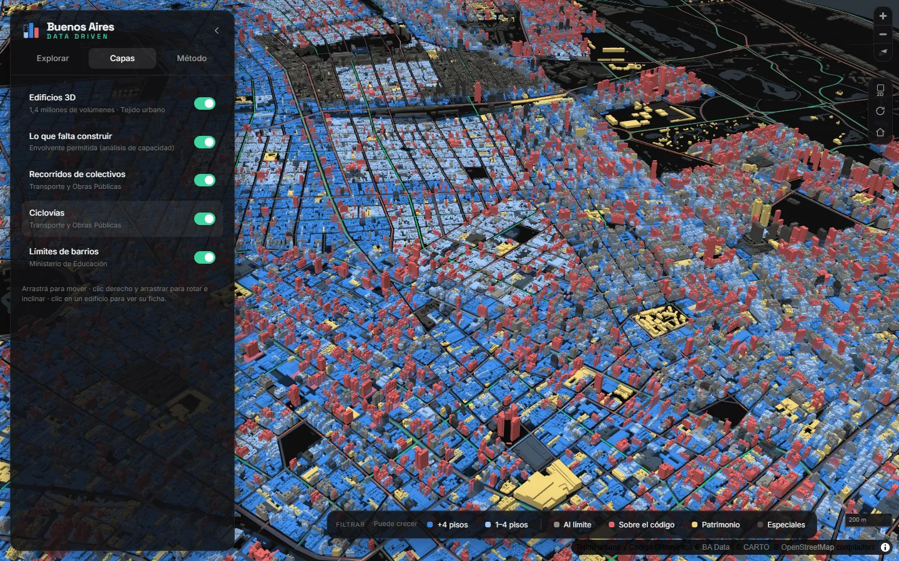 | 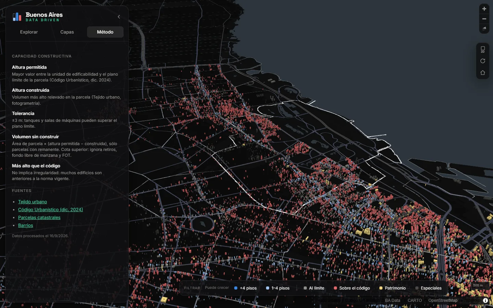 |

### Celular

En pantallas chicas el panel pasa a ser una hoja inferior y la leyenda se desliza en horizontal.

<p align="center">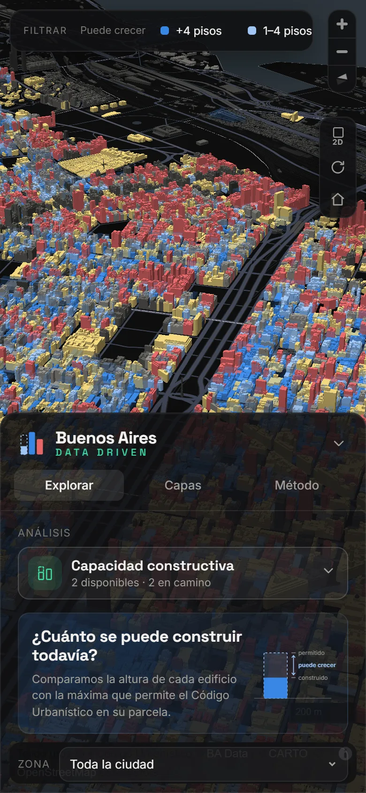</p>

### Otras funciones

- **Cámara:** animación de entrada, órbita automática, alternancia 2D/3D y botón de vista inicial.
- **Avisos de carga:** "Cargando edificios…" al descargar datos y "Aplicando…" al cambiar de análisis; si el cambio
  tarda, el mapa se atenúa para que no se confunda con el resultado final.
- **Enlaces compartibles:** el análisis activo viaja en la URL (`#capacidad`, `#altura`).
- **Accesibilidad:** colores validados para visión de colores atípica, leyendas siempre con texto, navegación por
  teclado en el panel y respeto de "reducir movimiento" del sistema.

---

## Análisis

### Capacidad constructiva

> **¿Cuánto se puede construir todavía?**

Para cada parcela se compara la altura construida con la máxima que permite el Código Urbanístico.

| Concepto | Definición |
|---|---|
| Altura permitida | Mayor valor entre la *unidad de edificabilidad* y el *plano límite* de la parcela (Código Urbanístico, dic. 2024). La relación entre ambos no es uniforme en el dataset, por eso se toma el máximo. |
| Altura construida | Volumen más alto relevado en la parcela (Tejido urbano). Parcelas sin volúmenes: 0 m (baldíos, playas, espacios abiertos). |
| Tolerancia | ±3 m: tanques, salas de máquinas y cajas de escalera pueden superar el plano límite. |
| Volumen sin construir | Área de la parcela × (permitida − construida), sólo en parcelas con remanente. Es una **cota superior**: no descuenta retiros, fondo libre de manzana ni FOT. |

**Categorías** (escala divergente: azul = puede crecer, gris = en el límite, rojo = supera):

| Color | Categoría | Criterio |
|---|---|---|
| `#3987e5` | Puede crecer +4 pisos | construida más de 12 m por debajo de la permitida |
| `#9ec5f4` | Puede crecer 1 a 4 pisos | entre 3 y 12 m por debajo |
| `#8f8d87` | Ya usa lo permitido | diferencia dentro de ±3 m |
| `#e66767` | Más alto que el código actual | más de 3 m por encima |
| `#eed27a` | Patrimonio protegido | parcela catalogada (tiene prioridad sobre el resto) |
| `#4a4945` | Reglas especiales | distritos sin altura única: urbanizaciones (U), áreas de protección histórica (APH), RUA, etc. |
| `#2e2e2c` | Sin dato | la parcela no figura en el Código Urbanístico publicado |

> **Importante:** "más alto que el código actual" **no implica una infracción**. La mayoría son edificios anteriores a
> la norma vigente; por eso se concentran en los barrios centrales e históricos.

**Resultados (toda la ciudad):**

| Indicador | Valor |
|---|---|
| Parcelas que todavía pueden crecer en altura | **80 %** (35 % más de 4 pisos, 45 % de 1 a 4) |
| Parcelas más altas que el código actual | **3,6 %** (11.556) |
| Parcelas que ya usan lo permitido | 7,7 % |
| Volumen teórico sin construir | ~1.154 millones de m³ |

| Dónde más se puede crecer (volumen) | Dónde más se supera el código actual (% de parcelas) |
|---|---|
| 1. Mataderos — 64 M m³ | 1. Retiro — 19,5 % |
| 2. Flores — 57 M m³ | 2. San Nicolás — 14,0 % |
| 3. Balvanera — 51 M m³ | 3. Recoleta — 13,6 % |
| 4. Villa Lugano — 46 M m³ | 4. San Telmo — 12,4 % |
| 5. Almagro — 45 M m³ | 5. Monserrat — 9,7 % |

### Altura de la ciudad

> **¿Cómo crece la ciudad en altura?**

Cada edificio se pinta con una rampa secuencial de un solo tono según su altura: cuanto más claro, más alto.

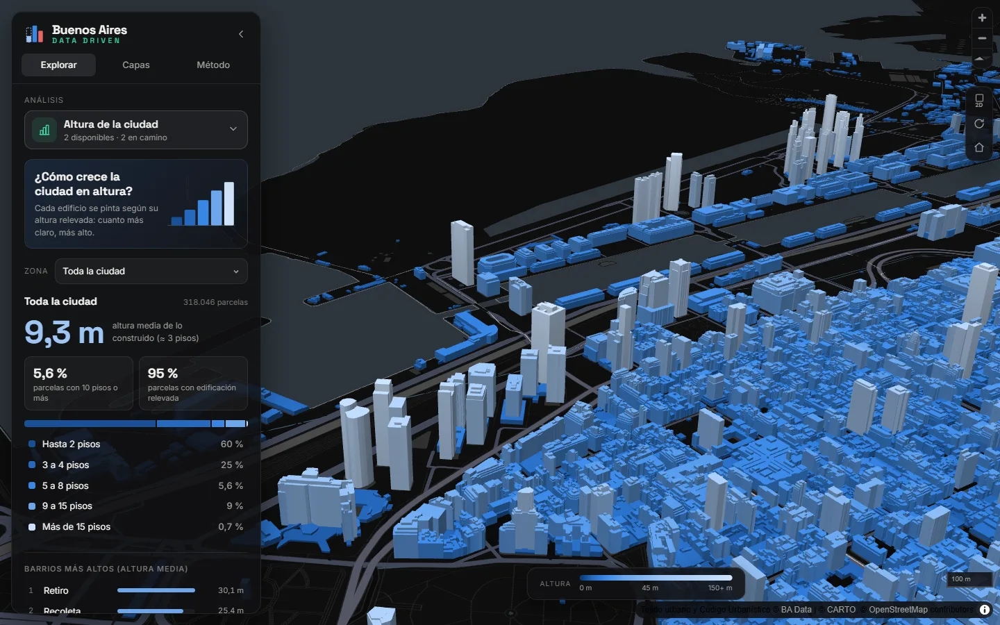

| Indicador (toda la ciudad) | Valor |
|---|---|
| Altura media de lo construido | **9,3 m** (≈ 3 pisos) |
| Parcelas con 10 pisos o más (≥ 30 m) | 5,6 % |
| Parcelas con edificación relevada | 95 % |
| Distribución | 60 % hasta 2 pisos · 25 % de 3 a 4 · 5,6 % de 5 a 8 · 9 % de 9 a 15 · 0,7 % más de 15 |

Barrios más altos por altura media: Retiro (30,1 m), Recoleta (25,4 m), San Nicolás (24,8 m), Monserrat (17,5 m) y
Palermo (16,7 m). Los más bajos rondan los 5 m (Villa Lugano, Villa Soldati, Villa Riachuelo).

La altura media se calcula sobre la altura máxima de cada parcela con edificación; los pisos se estiman a razón de 3 m.

### Próximos análisis

| Análisis | Pregunta |
|---|---|
| Sol y sombra | ¿Qué calles y plazas pierden sol si se construye todo lo permitido? |
| Densidad y transporte | ¿Se puede construir más donde hay subte, tren y Metrobus? |

---

## Cómo funciona

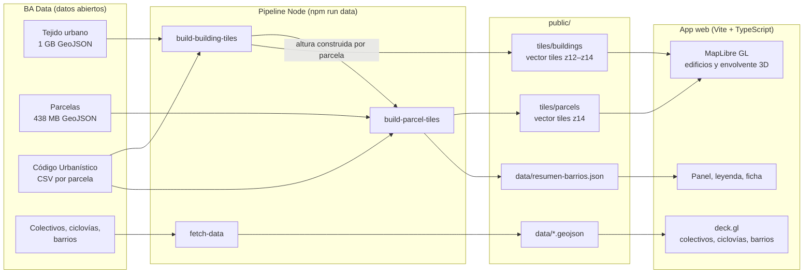

### Stack

| Pieza | Rol |
|---|---|
| [Vite](https://vite.dev) + TypeScript | Build y servidor de desarrollo; interfaz sin framework |
| [MapLibre GL JS 5](https://maplibre.org) | Mapa base, edificios y envolvente 3D (`fill-extrusion` sobre vector tiles) |
| [deck.gl 9](https://deck.gl) (`MapboxOverlay` intercalado) | Capas de datos: colectivos, ciclovías, barrios |
| [CARTO Dark Matter](https://github.com/CartoDB/basemap-styles) | Mapa base gratuito, sin API key |
| Node (`geojson-vt` + `vt-pbf`) | Conversión de los GeoJSON gigantes en vector tiles estáticos |
| Space Grotesk + Inter | Tipografías incluidas en el proyecto (sin servicios externos) |
| `puppeteer-core` | Smoke test, benchmark y capturas con el Edge/Chrome instalado |

> MapLibre se mantiene en la **v5** porque deck.gl 9.4 todavía no es compatible con MapLibre 6 (usa `map.transform`,
> que v6 hizo privado). `npm audit` informa un XSS en `DOM.sanitize` de v5; el proyecto no inserta HTML de terceros a
> través de MapLibre. Migrar cuando deck.gl lo soporte.

---

## Puesta en marcha

**Requisitos:** Node.js 20.11 o superior, ~2 GB libres para las descargas y, para las pruebas, Edge o Chrome instalado.

```bash
git clone https://github.com/meryboth/buenos-aires-data.git
cd buenos-aires-data
npm install
npm run data        # descarga los datasets y genera tiles (~3 min, baja ~1,6 GB la primera vez)
npm run dev         # http://localhost:5180
```

Los tiles y datos generados (~130 MB) **no están en el repositorio**: `npm run data` los reconstruye.

Las descargas crudas se guardan **fuera del proyecto**, en `~/.cache/digital-buenos-aires` (configurable con la
variable `DBA_CACHE_DIR`), para no sincronizar gigas a carpetas como OneDrive. Una segunda corrida reutiliza lo
descargado.

### Publicar

`npm run build` genera la app en `dist/` (incluye los tiles, que conviene servir comprimidos). Antes de publicar,
definí la URL definitiva en `.env`:

```bash
VITE_SITE_URL=https://tu-dominio.org
```

Con eso se agregan el enlace canónico y `og:url`, y la miniatura para redes se sirve desde el propio sitio. Sin esa
variable, la miniatura se toma del repositorio. La app también es instalable (manifiesto web con íconos para
escritorio, Android e iOS).

### Parámetros de URL

| Parámetro | Efecto |
|---|---|
| `#capacidad`, `#altura` | Abre directamente ese análisis |
| `?nointro` | Omite la animación de entrada |
| `?workers=N` | Cantidad de workers de MapLibre (por defecto, 2 a 4 según los núcleos) |
| `?aa=0` / `?aa=1` | Fuerza el antialiasing (por defecto, sólo en pantallas de densidad normal) |
| `?debug` | Expone `window.map` en producción (lo usan las pruebas automáticas) |

## Scripts

| Script | Qué hace |
|---|---|
| `npm run dev` | Servidor de desarrollo en `http://localhost:5180` |
| `npm run build` | Chequeo de tipos y build de producción en `dist/` |
| `npm run preview` | Sirve el build en `http://localhost:4180` |
| `npm run typecheck` | Sólo el chequeo de tipos |
| `npm run data` | Pipeline completo: `data:fetch` + `data:buildings` + `data:parcels` |
| `npm run data:fetch` | Colectivos, ciclovías y barrios → `public/data/` (acepta nombres: `npm run data:fetch -- barrios`) |
| `npm run data:buildings` | Tejido urbano + normativa → `public/tiles/buildings/` |
| `npm run data:parcels` | Parcelas + normativa → `public/tiles/parcels/` y `public/data/resumen-barrios.json` |
| `npm run smoke` | Prueba de humo con navegador headless ([ver abajo](#pruebas-y-benchmark)) |
| `npm run bench` | Benchmark de rendimiento con GPU real |
| `npm run docs:screenshots` | Regenera las capturas y el GIF de este README |
| `npm run brand` | Regenera íconos, miniatura para redes (`public/og-image.jpg`) y vista previa del repo (`docs/social-preview.jpg`) |

---

## Pipeline de datos

| Capa | Dataset | Procesamiento |
|---|---|---|
| Edificios 3D | [Tejido urbano](https://data.buenosaires.gob.ar/dataset/tejido-urbano) (1,08 GB) | `scripts/build-building-tiles.mjs` |
| Normativa | [Código Urbanístico](https://data.buenosaires.gob.ar/dataset/codigo-urbanistico) (CSV, 318 mil parcelas) | `scripts/lib/zoning.mjs`, se une por SMP |
| Parcelas | [Parcelas catastrales](https://data.buenosaires.gob.ar/dataset/parcelas) (438 MB) | `scripts/build-parcel-tiles.mjs` |
| Colectivos | [Recorridos de colectivos](https://data.buenosaires.gob.ar/dataset/colectivos-recorridos) | `scripts/fetch-data.mjs` |
| Ciclovías | [Ciclovías](https://data.buenosaires.gob.ar/dataset/ciclovias) | `scripts/fetch-data.mjs` |
| Barrios | [Barrios](https://data.buenosaires.gob.ar/dataset/barrios) | `scripts/fetch-data.mjs` |

### Cómo se generan los tiles

Los GeoJSON de BA Data traen un feature por línea, así que se procesan **en streaming**, sin cargarlos enteros en
memoria (`scripts/lib/tiles.mjs`):

1. **Agrupado:** cada feature se escribe en archivos NDJSON por tile del zoom mínimo que toca (con un margen para el
   buffer de los tiles vecinos).
2. **Corte:** por cada grupo, `geojson-vt` corta los tiles de cada zoom y `vt-pbf` los codifica en formato Mapbox Vector
   Tile.

| Tiles | Zooms | Filtro por zoom | Resultado |
|---|---|---|---|
| Edificios | z12–z14 (z15+ se sobre-amplía) | z12: ≥ 30 m · z13: ≥ 9 m · z14: todos | 92 tiles, ~98 MB (máx. 3 MB) |
| Parcelas | z14 | todas | 67 tiles, ~32 MB (máx. 1 MB) |

Cada volumen lleva su altura, el SMP de la parcela y las propiedades del análisis (`hcons` altura construida máxima de
la parcela, `perm` altura permitida, `cat` categoría y `dist` distrito especial). El id va en el campo nativo del tile.

### Detalles y decisiones

- **SMP normalizado.** Cada dataset escribe el código de parcela distinto (`087-006A-015`, `87-006A-015`,
  `055 - 200 - 005`); se normaliza antes de unir. El cruce cubre el **97,4 %** de las parcelas con edificios.
- **Alturas dudosas.** Valores mayores a 300 m son errores de relevamiento (el edificio más alto de la ciudad ronda los
  235 m); se acotan, quedan marcados como `sospechosa` y no cuentan para la altura de la parcela.
- **GeoJSON del Código Urbanístico corrupto.** El archivo publicado empieza a mitad de un registro; se usa el CSV, que
  trae la misma información por parcela.
- **Acceso al portal.** BA Data rechaza clientes sin User-Agent de navegador; los scripts lo envían.
- **Resumen por barrio.** `build-parcel-tiles` calcula, para la ciudad y cada barrio, la cantidad de parcelas por
  categoría, el volumen sin construir y las estadísticas de altura. La app lo lee de `resumen-barrios.json`.

---

## Rendimiento

La app se optimizó midiendo cada cambio con `npm run bench` (mediana de 5 corridas, notebook con Ryzen 9 4900HS y
Radeon integrada, vista inicial en 1400×850):

| Métrica | Antes | Después |
|---|---|---|
| Carga hasta ver todo | 15,8 s | **5,9 s** |
| Tiles descargados | 20,2 MB | 17,5 MB |
| Memoria JS | 28 MB | 23 MB |
| Peso total de los tiles | 162 MB | 130 MB |

**Qué se hizo y por qué:**

- **Una fuente por vista y carga diferida.** En MapLibre, agregar una capa, cambiar un filtro o un color que depende de
  los datos reprocesa *toda* la fuente con todas sus capas. Cada vista (capacidad, altura y filtro) usa su propia
  fuente sobre los mismos tiles y se crea recién al usarla; después se alterna por opacidad, que es instantáneo.
  Precargar la vista de altura costaba ~7 s, y separar cada categoría en su propia capa duplicaba el trabajo.
- **Más workers.** MapLibre 5 procesa los tiles con un solo worker salvo en Safari; con 2 a 4 la carga baja ~20 %.
  Más de 4 no mejora.
- **Envolvente liviana.** Una sola capa, sólo desde zoom 14 y sin descargar parcelas fuera del análisis de capacidad
  (costaba ~4 s de carga y 10 FPS).
- **Tiles más chicos.** El id va en el campo nativo del tile y no además como propiedad (−18 %).
- **Hover.** Como máximo una consulta por cuadro, ninguna con la cámara en movimiento, y sin leer píxeles de deck.gl
  si no hay capas de líneas activas.
- **Antialiasing sólo en pantallas comunes.** En GPUs integradas cuesta ~25 % de FPS y en pantallas de alta densidad
  casi no se nota.
- **Opacidad exactamente 1** en las capas activas: MapLibre dibuja las extrusiones en una sola pasada.
- **Pantalla de carga** que se va con los primeros edificios; el resto se completa con un aviso.

**Compensaciones:** el primer cambio a "Altura" y el primer filtro tardan ~1–2 s (procesan su fuente, con aviso en
pantalla); los siguientes son instantáneos. Al girar la cámara, la GPU integrada queda en ~28 FPS (~36 sin
antialiasing). Al publicar, conviene servir los tiles comprimidos: con gzip pesan la mitad.

---

## Pruebas y benchmark

Las pruebas usan el Edge o Chrome instalado (`puppeteer-core`, sin descargar navegadores). Si no está en la ruta
habitual, definí `BROWSER_PATH`.

```bash
# Prueba de humo: carga, errores de consola, clic en un edificio y captura
npm run smoke -- http://localhost:5180/ captura.png --all-layers --at=-58.4435,-34.6195,16.3

# Benchmark contra el build de producción
npm run build
npm run preview
npm run bench -- http://localhost:4180/ --runs=5
```

| Opción del smoke test | Efecto |
|---|---|
| `--all-layers` | Activa todas las capas antes de verificar |
| `--at=lon,lat,zoom[,pitch,bearing]` | Posiciona la cámara |

El benchmark usa la GPU real (`--use-angle=d3d11`) e informa carga, datos descargados por la página y sus workers,
memoria, FPS orbitando, costo del hover y tiempos de cambio de análisis y de filtro.

---

## Estructura del código

```
├─ index.html              metadatos (SEO, Open Graph, datos estructurados), pantalla de carga e interfaz
├─ public/                 favicon, íconos, manifiesto web y miniatura para redes
├─ vite.config.ts          sirve los tiles desde disco, metadatos según VITE_SITE_URL y puertos
├─ scripts/
│  ├─ fetch-data.mjs       datasets livianos → public/data
│  ├─ build-building-tiles.mjs
│  ├─ build-parcel-tiles.mjs
│  ├─ smoke.mjs            prueba de humo
│  ├─ bench.mjs            benchmark
│  ├─ screenshots.mjs      capturas de este README
│  ├─ brand-assets.mjs     íconos, miniatura para redes y vista previa del repo
│  └─ lib/
│     ├─ common.mjs        descargas, caché y utilidades
│     ├─ tiles.mjs         generador genérico de vector tiles en streaming
│     └─ zoning.mjs        normativa por parcela y clasificación
├─ src/
│  ├─ main.ts              arranque, estado, cámara, hover y clics
│  ├─ config.ts            vista inicial, mapa base, rampas y categorías
│  ├─ analysis.ts          tipos del resumen y datos de la ficha
│  ├─ analyses/            un módulo por análisis + registro
│  ├─ layers/
│  │  ├─ buildings.ts      vistas de edificios (una fuente por vista)
│  │  ├─ envelope.ts       envolvente permitida sin construir
│  │  └─ transport.ts      capas deck.gl
│  ├─ ui/                  panel, leyenda, ficha, herramientas, avisos y gráficos
│  └─ style.css
└─ docs/                   capturas de la documentación y vista previa del repo
```

---

## Cómo agregar un análisis

Cada análisis es un objeto `AnalysisDef` (`src/analyses/types.ts`):

```ts
export const miAnalisis: AnalysisDef = {
  id: 'mi-analisis',                 // también se agrega al tipo AnalysisId
  title: 'Título en el selector',
  question: '¿Qué pregunta responde?',
  description: 'Una oración que explique cómo se lee el mapa.',
  status: 'disponible',              // o 'proximamente'
  icon: '<path d="…"/>',             // contenido de un <svg> de 24×24
  diagram: '<svg …>…</svg>',         // opcional: diagrama de la tarjeta explicativa
  colorMode: 'normativa',            // cómo se pintan los edificios
  envelope: false,                   // mostrar la envolvente sin construir
  filterable: false,                 // la leyenda filtra categorías
  stats: ({ area, summary, focus }) => '…',  // HTML de las estadísticas (ciudad o barrio)
  rankings: (summary) => [ … ],               // rankings de barrios
  method: (summary) => '…',                   // texto de la pestaña Método
};
```

1. Crear el módulo en `src/analyses/` (ver `capacidad.ts` y `altura.ts`).
2. Registrarlo en `ANALYSES` (`src/analyses/index.ts`).
3. Si necesita datos nuevos por barrio, agregarlos en `scripts/build-parcel-tiles.mjs` y en el tipo `AreaSummary`.
4. Si necesita otra forma de pintar los edificios, sumar una vista en `src/layers/buildings.ts` con **su propia fuente**
   (ver [Rendimiento](#rendimiento)).

`src/ui/charts.ts` ofrece piezas listas: indicadores (`kpi`), barra apilada con desglose (`stackWithBreakdown`) y
rankings (`rankingsHtml`).

---

## Limitaciones conocidas

- **Normativa simplificada.** No se modelan retiros, fondo libre de manzana ni FOT; el volumen sin construir es una
  cota superior útil para comparar barrios, no una cifra de mercado.
- **Altura relevada.** La fotogrametría incluye elementos de azotea, y el relevamiento puede no reflejar obras
  recientes.
- **Cruce incompleto.** Un 2,6 % de las parcelas con edificios no tiene normativa asociada.
- **Vista de barrio.** Con el mapa alejado (zoom 13) se ocultan las construcciones de menos de 9 m para aligerar los
  tiles, y en los barrios bajos predomina la envolvente.
- **Subte.** Se dejó fuera por ahora.
- **Publicación.** Los tiles no están en el repositorio: para publicar la app hay que alojarlos aparte (ver
  [Hoja de ruta](#hoja-de-ruta)).

## Hoja de ruta

¿Querés tomar alguno de estos puntos? Comentalo en un issue o abrí uno nuevo (ver [Colaborá](#colaborá)).

- [ ] Análisis **Sol y sombra**.
- [ ] Análisis **Densidad y transporte**.
- [ ] Publicar la app: tiles empaquetados en **PMTiles** y comprimidos, en un hosting estático.
- [ ] Mostrar todas las construcciones a escala barrio.
- [ ] Vehículos en tiempo real con la API de Transporte de la Ciudad (requiere credenciales).
- [ ] Sumar capas producidas en QGIS (GeoJSON o GeoPackage) al pipeline.
- [ ] Migrar a MapLibre 6 cuando deck.gl lo soporte.

---

## Fuentes, licencias y créditos

- **Datos:** [BA Data](https://data.buenosaires.gob.ar), Gobierno de la Ciudad de Buenos Aires. Los datasets usados se
  publican bajo licencia [Creative Commons Atribución 2.5 Argentina](https://creativecommons.org/licenses/by/2.5/ar/)
  (ver la ficha de cada dataset).
- **Mapa base:** © [CARTO](https://carto.com/attributions) · © colaboradores de
  [OpenStreetMap](https://www.openstreetmap.org/copyright).
- **Librerías:** MapLibre GL JS (BSD-3), deck.gl (MIT), Vite (MIT), geojson-vt (ISC), vt-pbf (MIT), puppeteer-core
  (Apache-2.0), Inter y Space
  Grotesk (SIL OFL).
- **Código de este repositorio:** [licencia MIT](LICENSE). Las contribuciones se publican bajo la misma licencia.
